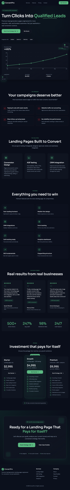

# Premium Lead Generation Landing Page

Premium, conversion-focused landing page built with React + Vite.

Original design reference:
https://www.figma.com/design/bt46l1tggcaNZw3lGRlBu4/Premium-Lead-Generation-Landing-Page

## Project Screenshot



## Project Overview

This repository contains a single-page marketing site designed for lead generation agencies and service businesses. It uses a dark premium visual style, motion-heavy section reveals, and clear conversion-focused CTAs.

Current page flow:

1. Navigation
2. Hero
3. Problem section
4. Solution section
5. Feature section
6. Social proof
7. Pricing
8. Final CTA
9. Footer

## Tech Stack

- React 18
- TypeScript (TSX)
- Vite 6
- Tailwind CSS v4 (`@tailwindcss/vite`)
- `motion/react` for animations
- `lucide-react` for icons
- `recharts` for chart UI
- Radix UI primitives (included in `src/app/components/ui`)

## Getting Started

### Prerequisites

- Node.js 18+ recommended
- npm (project currently uses `package-lock.json`)

### Install Dependencies

```bash
npm i
```

### Start Development Server

```bash
npm run dev
```

### Create Production Build

```bash
npm run build
```

## Available Scripts

- `npm run dev` - start local dev server with HMR
- `npm run build` - build production assets into `dist/`

## Project Structure

```text
.
├── src/
│   ├── main.tsx
│   ├── app/
│   │   ├── App.tsx
│   │   └── components/
│   │       ├── Navigation.tsx
│   │       ├── Hero.tsx
│   │       ├── ProblemSection.tsx
│   │       ├── SolutionSection.tsx
│   │       ├── FeatureSection.tsx
│   │       ├── SocialProof.tsx
│   │       ├── Pricing.tsx
│   │       ├── FinalCTA.tsx
│   │       └── ui/
│   └── styles/
│       ├── index.css
│       ├── fonts.css
│       ├── tailwind.css
│       └── theme.css
├── index.html
├── vite.config.ts
└── postcss.config.mjs
```

## Styling & Theme

- Global style entrypoint: `src/styles/index.css`
- Theme tokens and design variables: `src/styles/theme.css`
- Fonts loaded from Google Fonts:
  - Display: `Sora`
  - Body: `DM Sans`
- Tailwind utilities are combined with CSS variables for consistent colors and spacing.

Primary visual direction in the current implementation:

- Dark slate background
- Emerald accent color
- Soft translucent cards/borders
- Motion-based section transitions

## Configuration Notes

### Vite

`vite.config.ts` includes:

- React plugin
- Tailwind plugin
- Custom `figma-asset-resolver` plugin for `figma:asset/*` imports

### Tailwind

Tailwind v4 is configured via CSS (`src/styles/tailwind.css`) and Vite plugin.

### PostCSS

`postcss.config.mjs` is intentionally minimal. Tailwind v4 integration is handled through `@tailwindcss/vite`.

## Customization Guide

### Update Marketing Copy

Edit section files in `src/app/components/`:

- Hero headline and CTA copy: `Hero.tsx`
- Problem/solution messaging: `ProblemSection.tsx`, `SolutionSection.tsx`
- Testimonials and stats: `SocialProof.tsx`
- Pricing tiers: `Pricing.tsx`
- Final conversion push: `FinalCTA.tsx`

### Update Theme

Change CSS variables in `src/styles/theme.css`:

- `--background`, `--foreground`
- `--primary`, `--accent`
- `--card`, `--border`, `--muted-*`
- Typography and radius tokens

## Build Output

Running `npm run build` outputs optimized assets to:

- `dist/index.html`
- `dist/assets/*`

## Notes

- This is currently a single-page app (no routing setup in use).
- Some nav anchor links may need corresponding section IDs if you add/remove sections.
- No test suite is configured yet.
  
